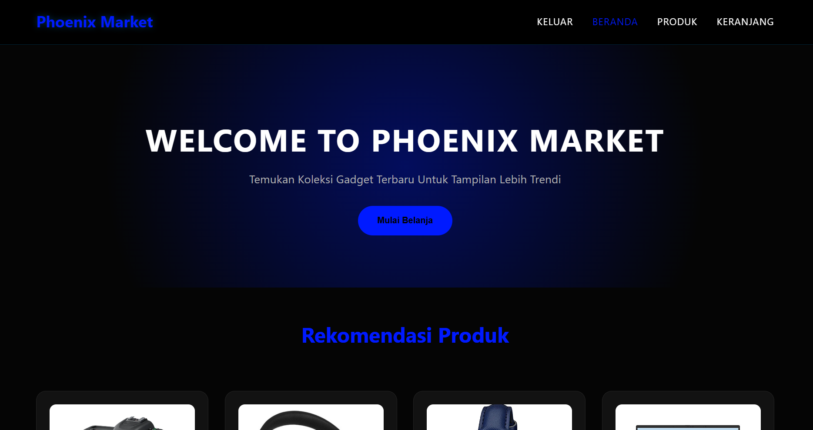
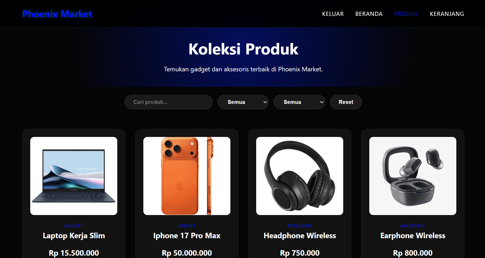
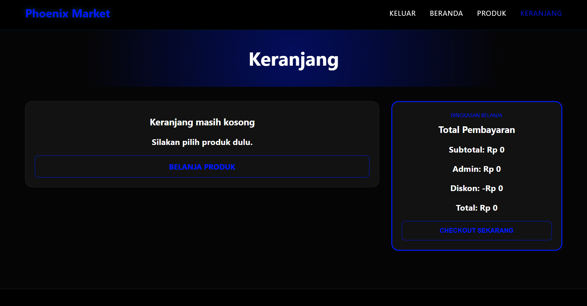
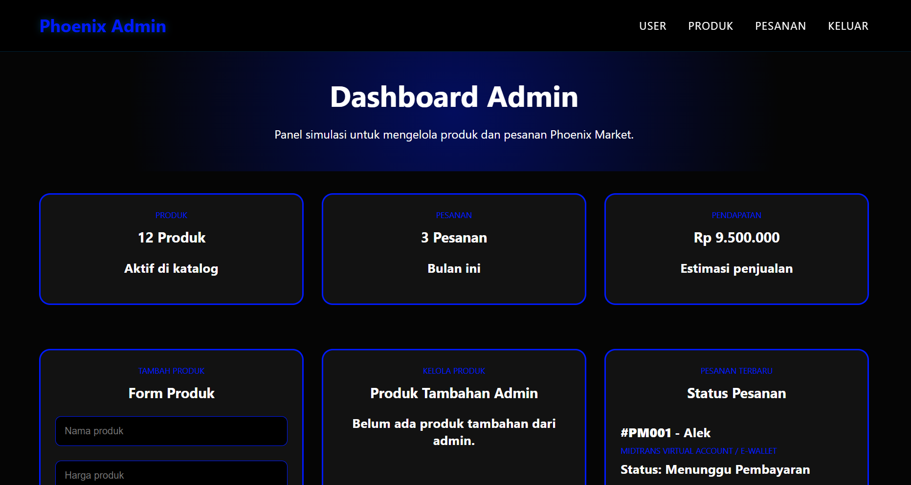
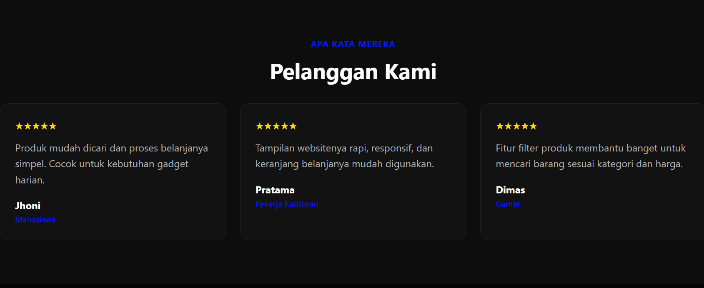
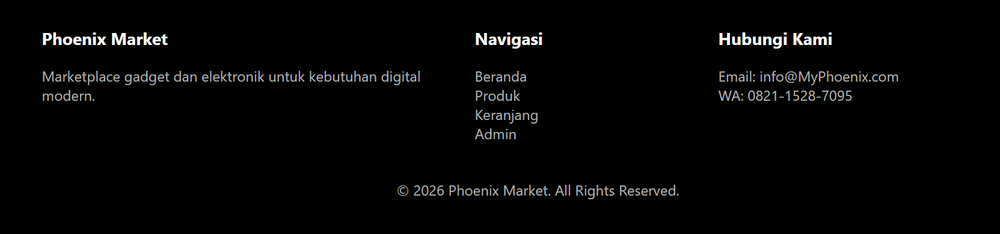

# Phoenix Market

Phoenix Market adalah prototype website e-commerce bertema gadget, elektronik, dan aksesoris modern. Website ini dibuat untuk menampilkan katalog produk, fitur pencarian dan filter, detail produk, keranjang belanja, serta simulasi proses checkout.

## Deskripsi Bisnis

Phoenix Market berfokus pada penjualan produk teknologi untuk kebutuhan belajar, bekerja, hiburan, gaming, dan rumah tangga modern. Website ini dibuat sebagai simulasi toko online yang mudah digunakan, responsif, dan memiliki alur belanja yang jelas dari pemilihan produk sampai checkout.

## Proposisi Nilai

Phoenix Market menawarkan pengalaman belanja elektronik yang sederhana, cepat, dan mudah dipahami. Pengguna dapat melihat katalog produk, mencari produk berdasarkan kebutuhan, memasukkan produk ke keranjang, mengubah jumlah barang, dan melakukan simulasi pembayaran dalam satu alur yang jelas.

## Target Pasar

Target pasar Phoenix Market adalah:

- Pelajar dan mahasiswa yang membutuhkan gadget untuk belajar
- Pekerja yang membutuhkan perangkat produktivitas
- Gamer yang membutuhkan aksesoris pendukung
- Kreator konten yang membutuhkan kamera, tablet, atau perangkat digital
- Keluarga modern yang membutuhkan elektronik rumah tangga

## Analisis Pasar dan Pesaing

Produk gadget dan elektronik memiliki permintaan tinggi karena digunakan dalam aktivitas sehari-hari, pendidikan, pekerjaan, hiburan, dan komunikasi. Konsumen biasanya mencari produk dengan harga jelas, gambar menarik, deskripsi singkat, serta proses checkout yang mudah.

Pesaing utama dalam pasar ini adalah marketplace besar seperti Tokopedia, Shopee, Lazada, serta toko elektronik lokal. Phoenix Market membedakan diri dengan katalog yang lebih fokus pada produk elektronik pilihan, tampilan sederhana, dan alur belanja yang mudah digunakan.

## Produk yang Dijual

Produk utama Phoenix Market meliputi:

- Laptop Kerja Slim
- Iphone 17 Pro Max
- Kamera DSLR Pro
- Headphone Wireless
- Earphone Wireless
- Mouse Gaming RGB
- Smart TV
- Jam Tangan Analog
- Apple iPad Pro
- Lampu Meja Antik
- AC Premium
- Kulkas Dua Pintu

## Strategi Manajemen Produk

Produk dikelompokkan ke dalam kategori Gadget, Elektronik, dan Aksesoris. Setiap produk memiliki nama, kategori, harga, gambar, dan deskripsi singkat. Produk unggulan ditampilkan pada halaman beranda, sedangkan seluruh produk tersedia di halaman katalog.

Halaman admin digunakan sebagai simulasi pengelolaan produk. Admin dapat menambahkan produk baru menggunakan localStorage. Pendekatan ini dipilih agar proyek tetap sesuai dengan ketentuan penggunaan HTML, CSS, dan JavaScript vanilla.

## Model Bisnis dan Aliran Pendapatan

Model bisnis Phoenix Market adalah Business to Consumer (B2C), yaitu menjual produk elektronik langsung kepada konsumen akhir.

Aliran pendapatan berasal dari:

- Penjualan produk gadget dan elektronik
- Margin keuntungan dari setiap produk
- Paket bundling produk, seperti laptop dengan mouse atau headphone
- Promo khusus pelanggan baru
- Potensi kerja sama dengan brand elektronik

## Strategi Harga

Phoenix Market menggunakan strategi harga kompetitif. Produk aksesoris dibuat lebih terjangkau, sedangkan produk premium seperti laptop, smartphone, dan tablet memiliki harga lebih tinggi sesuai kualitas dan target pembeli.

## Strategi Promosi

Promosi yang dapat digunakan:

- Diskon produk tertentu
- Promo bundling gadget dan aksesoris
- Gratis ongkir untuk minimum pembelian tertentu
- Voucher khusus pelanggan baru
- Promo musiman seperti back to school, akhir tahun, atau hari belanja online

## Fitur Website

Website Phoenix Market memiliki fitur:

- Halaman pembuka untuk memilih masuk sebagai User atau Admin
- Navbar dan halaman beranda
- Spanduk hero pada halaman beranda
- Bagian Tentang Kami, Statistik, Testimoni, dan Footer
- Katalog produk dengan 12 produk utama
- Filter produk berdasarkan nama, kategori, dan harga
- Detail produk menggunakan modal
- Keranjang belanja menggunakan localStorage
- Tambah produk ke keranjang
- Ubah jumlah produk di keranjang
- Hapus produk dari keranjang
- Perhitungan subtotal, biaya admin, diskon, dan total otomatis
- Checkout berbentuk popup agar halaman keranjang tetap rapi
- Form checkout dengan validasi sederhana
- Simulasi pembayaran dummy Midtrans Virtual Account, E-Wallet, dan Transfer Bank Manual
- Popup pesanan berhasil dengan nomor pesanan otomatis
- Dashboard admin simulasi
- Simulasi tambah produk melalui admin menggunakan localStorage
- Simulasi hapus produk tambahan melalui admin
- Simulasi update status pesanan
- Google Analytics dummy

## Checkout dan Payment Gateway

Checkout dibuat dalam bentuk popup agar halaman keranjang tetap sederhana. Pengguna mengisi nama, nomor telepon, alamat, kota, kode pos, dan memilih metode pembayaran.

Payment gateway yang digunakan adalah simulasi dummy seperti Midtrans Virtual Account, E-Wallet, dan Transfer Bank Manual. Setelah checkout berhasil, website menampilkan popup pesanan berhasil dengan nomor pesanan otomatis.

## Rencana SEO

Strategi SEO yang digunakan:

- Judul halaman yang jelas
- Deskripsi produk yang informatif
- Struktur heading yang rapi
- Nama file gambar yang sesuai produk
- Tampilan responsif untuk perangkat mobile
- Penggunaan teks alternatif pada gambar produk
- Konten produk yang relevan dengan kebutuhan target pasar

## Rencana Keamanan

Rencana keamanan website:

- Validasi form checkout
- Menggunakan HTTPS saat website dipublikasikan
- Tidak menyimpan data kartu pembayaran langsung di website
- Menggunakan payment gateway terpercaya
- Menjaga data pelanggan seperti nama, email, dan alamat
- Menghindari input kosong pada form penting
- Memisahkan data simulasi di localStorage

## Rencana Analytics

Google Analytics dummy digunakan untuk menggambarkan rencana pemantauan performa website.

Metrik yang akan dipantau:

- Jumlah pengunjung
- Halaman yang paling sering dibuka
- Produk yang paling sering dilihat
- Produk yang paling sering dimasukkan ke keranjang
- Bounce rate
- Conversion rate
- Jumlah transaksi checkout
- Perangkat yang digunakan pengunjung, seperti desktop atau mobile

Data analytics dapat digunakan untuk menentukan produk unggulan, memperbaiki halaman dengan bounce rate tinggi, mengevaluasi promosi, dan meningkatkan alur checkout.

## Teknologi yang Digunakan

- HTML5
- CSS3
- JavaScript ES6+
- Flexbox
- CSS Grid
- Media query
- LocalStorage
- Google Analytics dummy
- GitHub Pages

## Struktur File

Struktur utama proyek:

```text
Phoenix-Market/
|-- index.html
|-- IT-II-ZynXiz-Beranda.html
|-- IT-II-ZynXiz-Produk.html
|-- IT-II-ZynXiz-Keranjang.html
|-- IT-II-ZynXiz-Admin.html
|-- README.md
|-- css/
|   |-- style1.css
|   |-- style2.css
|   |-- style4.css
|   `-- style5.css
|-- js/
|   `-- phoenix-app.js
|-- images/
|   `-- file gambar produk dan logo
`-- screenshot/
    `-- dokumentasi tampilan website
```

## Deployment

Website dipublikasikan menggunakan GitHub Pages.

Link Repository GitHub:  
https://github.com/zyniz01-prog/Phoenix-Market

Link GitHub Pages:  
https://zyniz01-prog.github.io/Phoenix-Market/

## Video Demo

Video demo website Phoenix Market dapat dilihat melalui link berikut:

https://youtu.be/r0f2sGhc2fE?si=Hk3QTdp_uioKxNKP

## Dokumentasi Screenshot

Folder screenshot: `screenshot`

### Tampilan Desktop

| Halaman | Screenshot |
| --- | --- |
| Tampilan awal |  |
| Beranda |  |
| Produk |  |
| Keranjang |  |
| Checkout |  |
| Admin |  |
| Tentang Kami |  |
| Review |  |
| Footer |  |

### Tampilan Mobile

| Halaman | Screenshot |
| --- | --- |
| Tampilan awal mobile |  |
| Beranda mobile |  |
| Produk mobile |  |
| Keranjang mobile |  |
| Admin mobile |  |
| Footer mobile |  |

### Tampilan Responsif

| Halaman | Screenshot |
| --- | --- |
| Tampilan awal responsif |  |
| Beranda responsif |  |
| Produk responsif |  |
| Keranjang responsif |  |
| Admin responsif |  |

Screenshot yang sudah dilampirkan mencakup:

- Tampilan halaman beranda desktop
- Tampilan halaman produk desktop
- Tampilan halaman keranjang/checkout desktop
- Tampilan halaman admin desktop
- Tampilan awal website
- Tampilan tentang kami, review, dan footer
- Tampilan mobile dan responsif

## Rencana Commit Git

Commit dibuat secara bertahap dan bermakna, misalnya:

1. Membuat struktur awal proyek
2. Menambahkan halaman login dan navigasi
3. Menambahkan halaman beranda dan hero
4. Menambahkan katalog produk
5. Menambahkan fitur pencarian dan filter produk
6. Menambahkan fitur detail produk
7. Menambahkan keranjang belanja dengan localStorage
8. Menambahkan form checkout dan simulasi pembayaran
9. Menambahkan modal detail produk
10. Menambahkan dashboard admin simulasi
11. Menambahkan Google Analytics dummy
12. Memperbaiki tampilan responsif
13. Merapikan struktur folder dan path aset
14. Melengkapi dokumentasi README
15. Deploy website ke GitHub Pages

## Catatan Fitur Admin

Fitur admin pada proyek ini adalah simulasi pengelolaan produk dan pesanan menggunakan localStorage. Data produk tambahan disimpan di browser pengguna, bukan database server.

Pendekatan ini dipilih agar proyek tetap sesuai dengan ketentuan penggunaan HTML, CSS, dan JavaScript vanilla tanpa backend atau database.

Melalui halaman admin, pengguna dapat melakukan simulasi tambah produk, hapus produk tambahan, melihat ringkasan jumlah produk, melihat ringkasan pesanan, dan mengelola status pesanan secara sederhana.

Produk bawaan dari katalog utama tidak dapat dihapus melalui admin. Fitur hapus hanya berlaku untuk produk tambahan yang dibuat melalui form admin.

## Kesimpulan

Phoenix Market dibuat sebagai prototype website e-commerce yang menggabungkan konsep bisnis, desain responsif, fitur interaktif JavaScript, simulasi pembayaran, dashboard admin sederhana, dan dokumentasi strategi bisnis. Website ini menunjukkan alur dasar e-commerce mulai dari melihat produk, memilih produk, memasukkan ke keranjang, hingga checkout.
